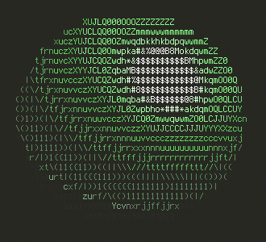
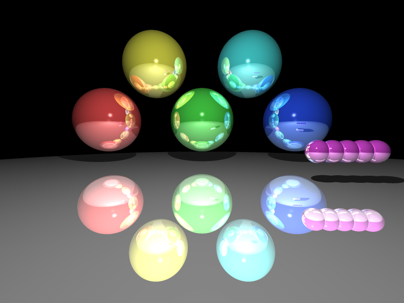

# Ray Tracer
A pretty simple raytracer in golang

## Examples
Rendering to stdout:  


Rendering to an image:  


## Building
(assuming that you already have your `GOPATH` setup correctly)

Just run `go build` in this repo's root, no external libraries are needed

## Usage
```
Usage of ./rtrace:
  -height int
        height of render target
  -width int
        width of render target
  -target string
        render target (use "-" for stdout) (default "-")
```
